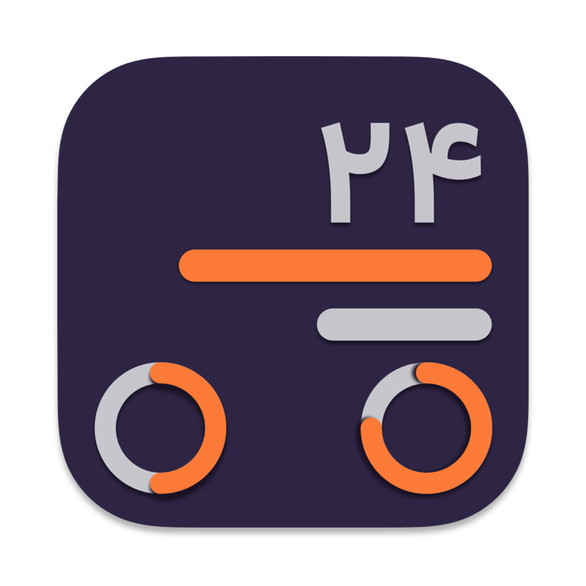
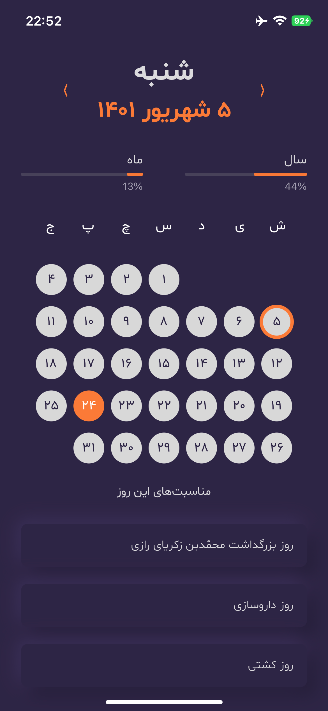
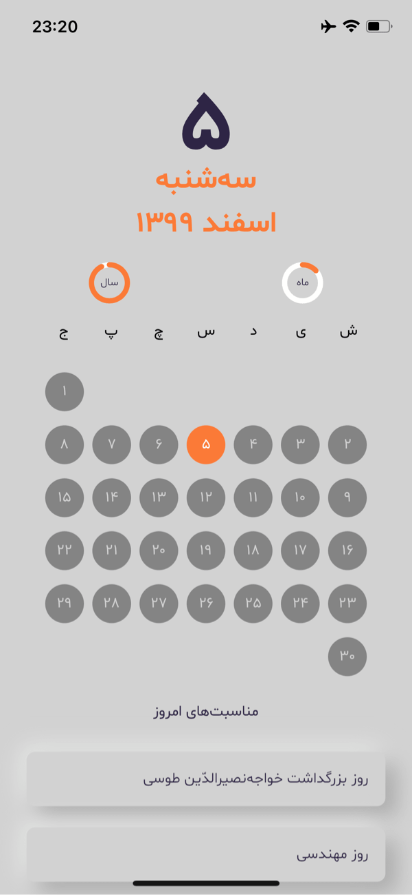
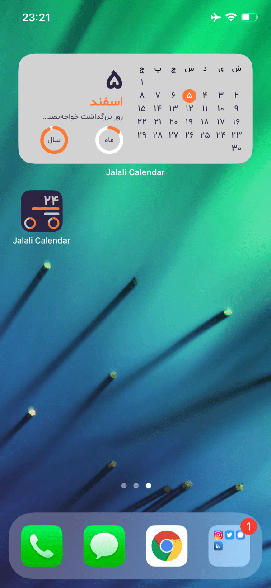
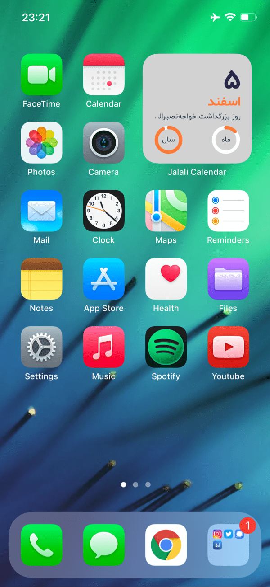
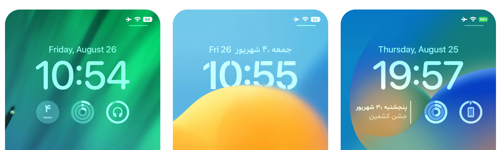

    
    <h1 align="center">Jalali Calendar</h1>
    <h4 align="center">A simple persian calendar with widgets for iOS and macOS</h4>
    

This project implemented in [Persian language](https://en.wikipedia.org/wiki/Persian_language) and has some [Persian events](https://en.wikipedia.org/wiki/List_of_festivals_in_Iran).

### Previews 📱

### Configure the project 🛠

- Clone the project
- **Important:** Open __`Config.xconfig`__ file with any editor except **xcode** and change __`CONFIG_BUNDLE_ID`__'s value to your **new app bundle identifier**.
- Open the __`JalaliCalendar.xcodeproj`__ file with xcode, open the project's file and go to __`Signing & Capabilities`__ and change the __`team`__.
- Build & run.

### Contribute 🧩

Want to contribute? I would really appreciate a hand with the development to add more features in this app.
Feel free to Fork, edit, then pull!

### Donation ✌🏻

#### Patreon

### Copyright Notice 📝

Copyright (C) 2022 Aseman
Licensed under the [GNU Version 3](https://www.gnu.org/licenses/gpl-3.0.en.html) license (see the LICENSE file).
