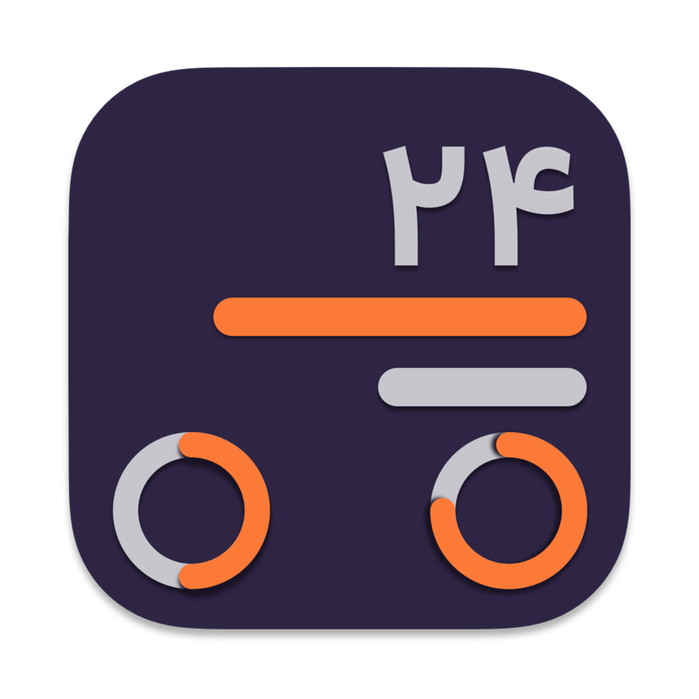

Jalali Calendar
======

A simple persian calendar with widgets. Written in [SwiftUI](https://developer.apple.com/xcode/swiftui/)

This project implemented in [Persian language](https://en.wikipedia.org/wiki/Persian_language) and has some [Persian events](https://en.wikipedia.org/wiki/List_of_festivals_in_Iran).

## Previews 📱

## How to build 🛠

1- Fork the project & Clone it to your desktop.

2- Open it from Xcode (12.0+).

3- Change  the Build identifier (for iOS Widget extension should be changed too).

5- build & run.

6- enjoy.

## Contribute 🧩

Want to contribute? I would really appreciate a hand with the development to add more features in this app.
Feel free to Fork, edit, then pull!

## Donation ✌🏻

#### Patreon

## Copyright Notice 📝

Copyright (C) 2021 Aseman

Licensed under the [GNU Version 3](https://www.gnu.org/licenses/gpl-3.0.en.html) license (see the LICENSE file).
